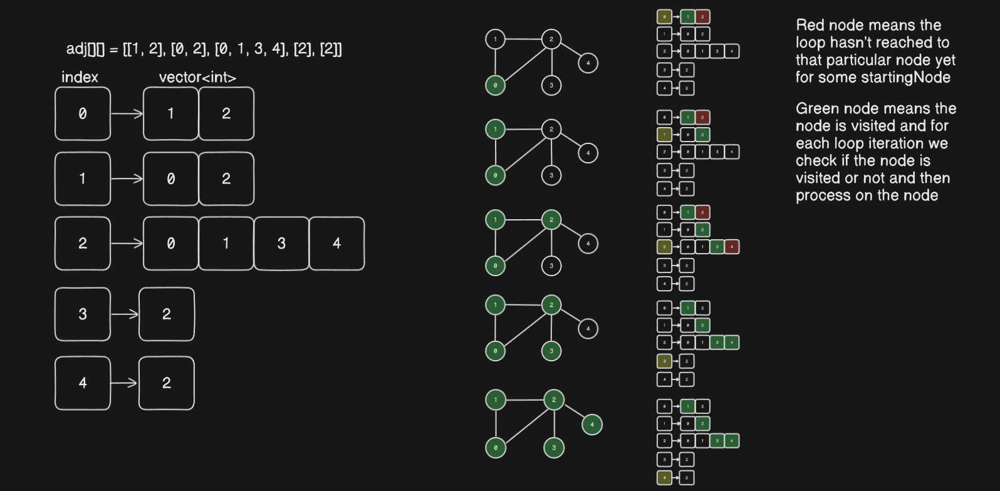
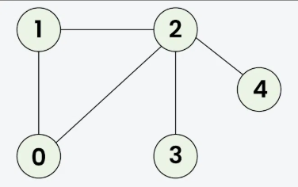

**DFS**
    Depth me jaate jao - Adjacent nodes ko visit karte jao baar baar iff vo visit nahi ki gayi ho pehle

    neighbour ka neighbour ka neighbour ..... pehle consider hota hai

**BFS**

    BFS me sabse pehle ek node pe jaate hain aur uske saare adjacent nodes ko queue me daaldete hai and then un nodes ke liye same process apply karte hain

    neighbour ke saare neighbour consider hote hain fir unke saare neighbour consider hote hain

    Input: adj[][] = [[1, 2],  [0, 2], [0, 1, 3, 4], [2], [2]]

    Input: adj[][] = [[1, 2],  [0, 2], [0, 1, 3, 4], [2], [2]]

    Output: [0, 1, 2, 3, 4]
    Explanation: Starting from 0, the BFS traversal proceeds as follows: 
    Visit 0 → Output: 0 
    Visit 1 (the first neighbor of 0) → Output: 0, 1 
    Visit 2 (the next neighbor of 0) → Output: 0, 1, 2 
    Visit 3 (the first neighbor of 2 that hasn't been visited yet) → Output: 0, 1, 2, 3 
    Visit 4 (the next neighbor of 2) → Final Output: 0, 1, 2, 3, 4