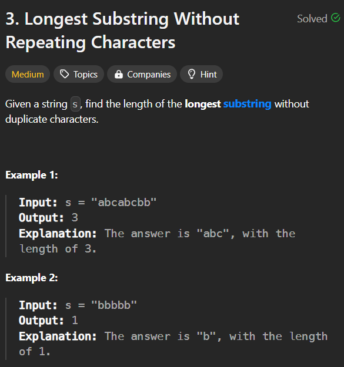

**Question**

**Solution**

1. Two pointers initialize karte hai i and j jo ki sliding window ki strarting and ending ko represent karta hai
2. Agar character present nahi hai map me iska matlab abhi tak wo aaya nahi hai apne sliding window me isliye simply umpp me insert kard aur maxlen update kardo
3. But agar chatacter present hai then aapko window ka start ko aage badaate jaana padega jab tak wo character window se bahaar na chale jaaye iske saath saath aapko umpp se character bhi remove karne honge.