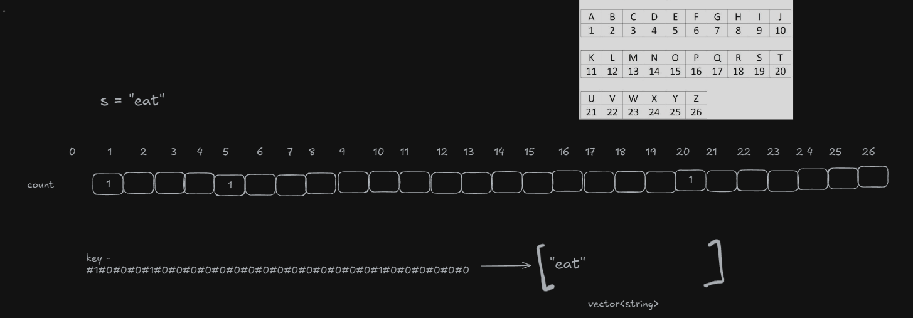

**Question**
 Group all the anagrams together

**Solution**

Approach 1: Sorting (Most Common) 
Idea: Sort each string and use the sorted version as the key in a hash map.

Steps:

1. For each string, sort its characters.

2. Use the sorted string as a key in a hash map.

3. Group original strings under the same key.

Approach 2: Count Characters (Optimized)
Idea: Count frequency of each character (26 lowercase letters) and use it as a unique signature key.

Steps:

1. For each string, create a frequency array of size 26.

2. Convert the frequency array into a string key.

3. Group original strings under the same key.

