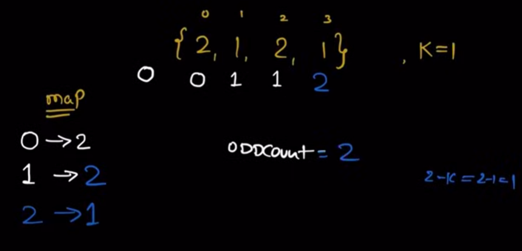

**Question**

    Count all the subarray with odd number of ks

**Input**

**Solution**

1. The approach is very much similar to prefix sum with sum equals to k approach

## Edge case

    umpp[0] =  1 kyo rakh rahe hain? 
    
    Maanlijiye k = 1 hain aur arr ke pehle index pe 1 aagya then jab hum check karenge umpp me toh hume value milegi hi nahi iska matlab wo array reject hojaayga valid hone ke baad bhi isliye ye by default set karna zaruri hai.

