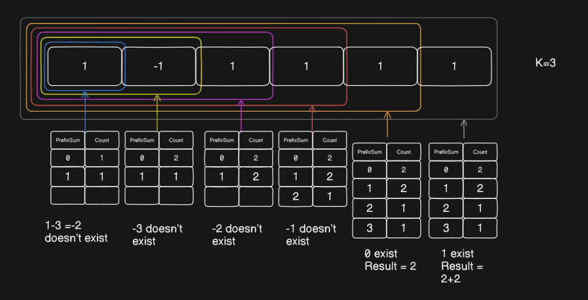

**Question**

    Given an array of integers nums and an integer k, return the total number of subarrays whose sum equals to k.

    A subarray is a contiguous non-empty sequence of elements within an array.

**Solution**

    1.Find the sum of all the subarrays and then count the number of subarrays with required sum this will take O(n^3) time complexity
    
    Que.Why we cannot use the sliding window approach here like we simply use two pointers to keep the track of the sum and if the sum becomes greater then we move the left ptr otherwise move the right ptr?
    Ans - The sliding window approach works well with positive numbers or fixed constraints but when it comes to negative numbers the shrinking does not gurantee the sum to be decreased because removing the negative number will increase the sum.

    In the below the constraint number 2 says that the element(s) of the nums array may contain -ve numbers.

        
    2. Hashing + prefix sum Approach
        while traversing the array check if sum-k exist in the map if it exist update the result otherwise insert the prefixSum in the map.
    
