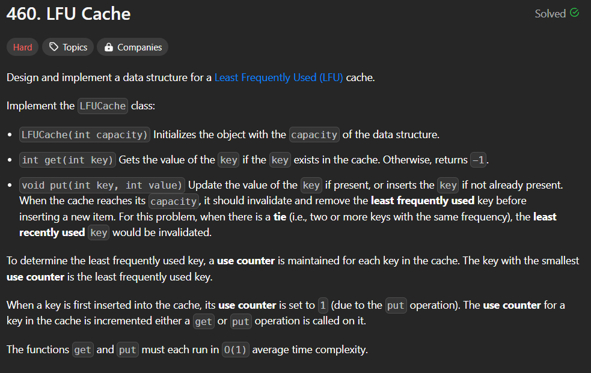
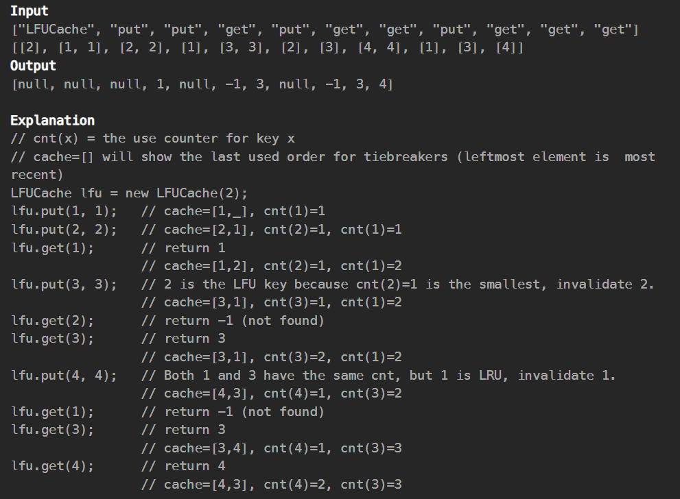
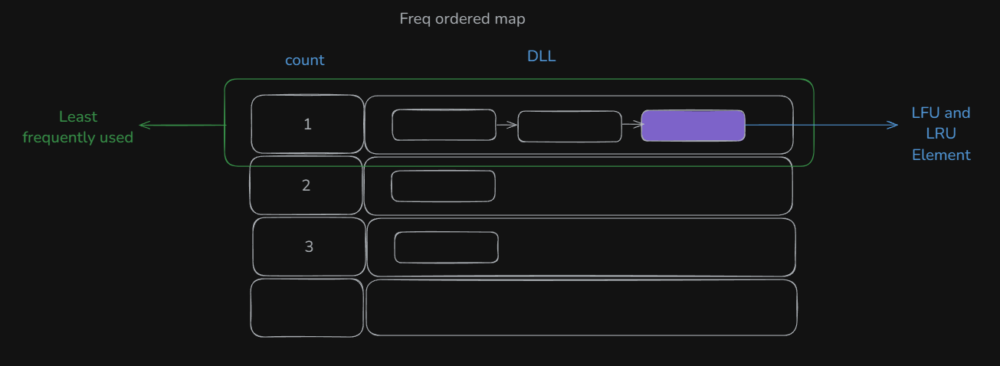

## Question

##Solution

✅ LFU Cache Algorithm
    📌 Data Structures:
    freq: A map from frequency → list of [key, value, freq]

    Keeps track of all keys with the same frequency

    Within the same frequency, uses LRU order (most recently used at the front)

    mp: A map from key → iterator pointing to that key's node in the frequency list

⚙️ Initialization
    LFUCache(capacity):
        cap = capacity
        size = 0

🔍 Get(key):

    If key not in mp:
        Return -1

    Else:
        value = mp[key]->value
        Update frequency of key:
            - Remove it from current freq list
            - If list empty, remove that freq from map
            - Increase freq by 1
            - Insert at front of freq[f+1] list
            - Update mp[key] to point to new location
        Return value

➕ Put(key, value):

    If cap == 0:
        Return

    If key exists:
        Update its value
        Call makeMostFrequentlyUsed(key)

    Else:
        If size < cap:
            Insert [key, value, 1] at front of freq[1]
            Update mp[key]
            size++

        Else:
            Evict one key:
                - From freq.begin() (lowest frequency)
                - Take the back of the list (least recently used)
                - Remove it from freq and mp
                - If list is empty, remove that freq
                - size stays same (replacing one)
            Insert [key, value, 1] at front of freq[1]
            Update mp[key]

🔁 makeMostFrequentlyUsed(key):

    Retrieve [key, value, freq] from mp
    Remove from freq[freq] list
    If list becomes empty, erase that freq entry
    Increase freq by 1
    Insert [key, value, freq+1] at front of freq[freq+1]
    Update mp[key] to point to new location