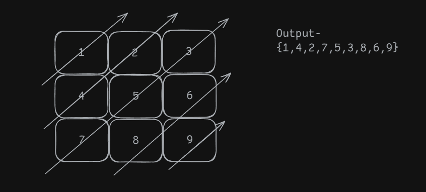

**Question**

**Solution**

        vector<int> findDiagonalOrder(vector<vector<int>>& mat) {
                vector<int> ans;
                int n = mat.size();
                int m = mat[0].size();
                int i = 0,j=0;
                //top-bottom
                while(i<n){
                    int x = i++,y=j;
                    do{
                        ans.push_back(mat[x][y]);
                        x-=1;y+=1;
                    }while(x>=0 and y>=0 and x<n and y<m);
                }
                //left to right
                i = n-1;
                j = 1;
                if(j<m){
                    while(j<m){
                        int x = i,y = j++;
                        do{
                            ans.push_back(mat[x][y]);
                            x--,y++;
                        }while(x>=0 and y>=0 and x<n and y<m);
                    }
                }
                return ans;
                
        }