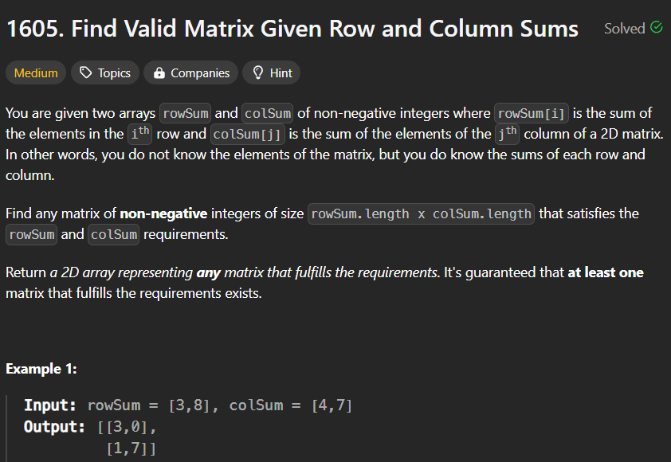

**Question**

**Solution**

1. rowSum pe i chalao and colSum pe j chalao starting from 0.
2. Find the minimum and place it at i,j index.
3. Decrement the minimum value from rowSum and colSum ith and jth index respectively.
4. jo zero hojaaye uska corresponding pointer ko increment kardo 

