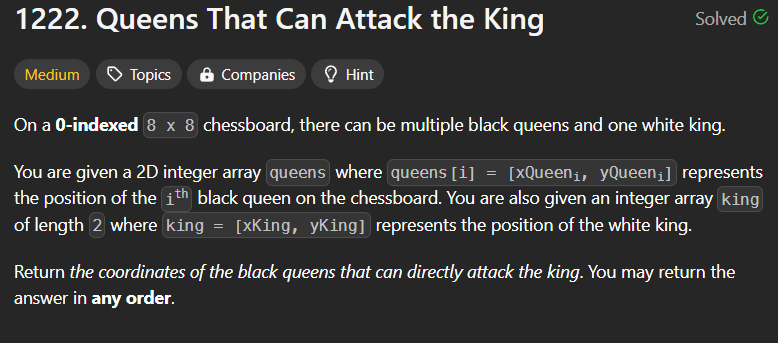
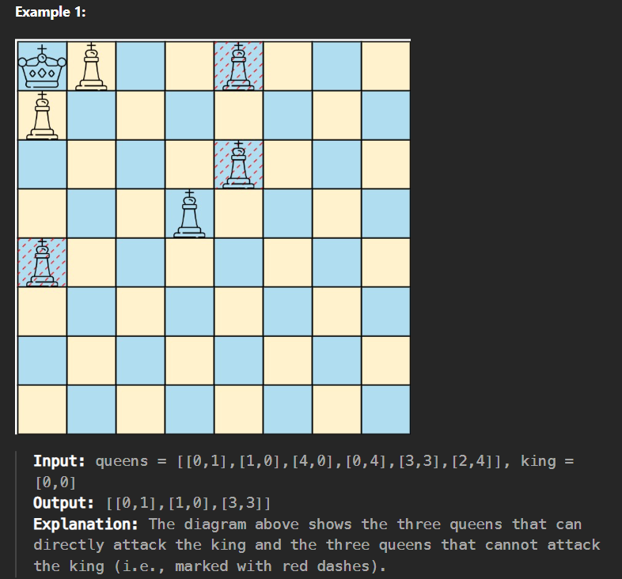

**Question**

**Solution**

1. Kisi ptr ko move karne ke liye sabse pehle dimaag me kyaa cheez aati hai ki ++ karde yaa -- karde but agar multiple directions me chalaana hai toh hum ye operations ka set bhi toh le sakte hain na.Initialize a directions vector matrix.

2. Board banao kahaan kahaan par queen hai wahaan par true kardo

3. har direction me traverse karo jab tak position board ke bahaar nahi chali jaaye