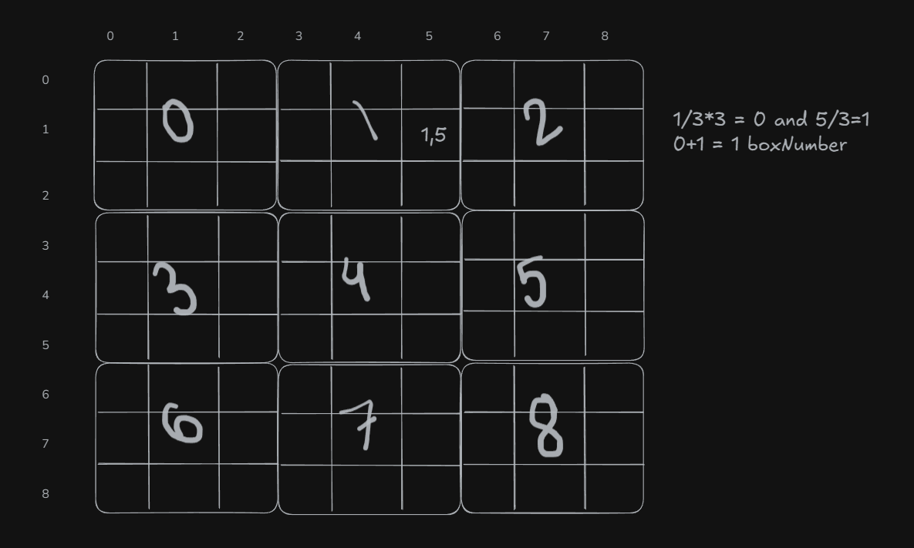

**Logic**

The box number logic

int boxNumber = (i/3)*3 + (j/3);

j/3 - left se number calculate karta hai wahi (i/3) top se number calculate karta hai aur kyoki har ek 1unit from top se 3 boxes cover hote hai we have to multiply by 3 into i/3.

