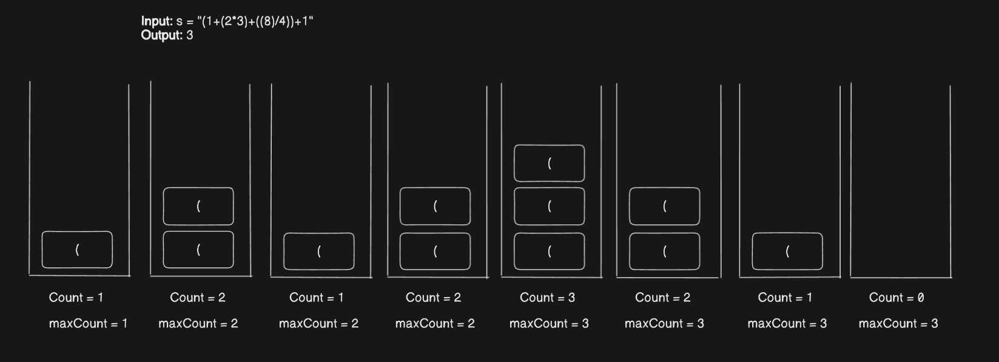

**Question**

Given a valid parentheses string s, return the nesting depth of s. The nesting depth is the maximum number of nested parentheses.

**Solution**

1. If the character of the string is opening bracket then push it into the stack and increase the count by 1
        Note - Count badaake hum ye assume karte hain ki iske baad vaali values maxm itne brackets ke andar zarur honge.
2. Update the maxCount as required.
3. For the closing bracket decrease the count by one.

Note - parentheses means - () you need not consider other brackets