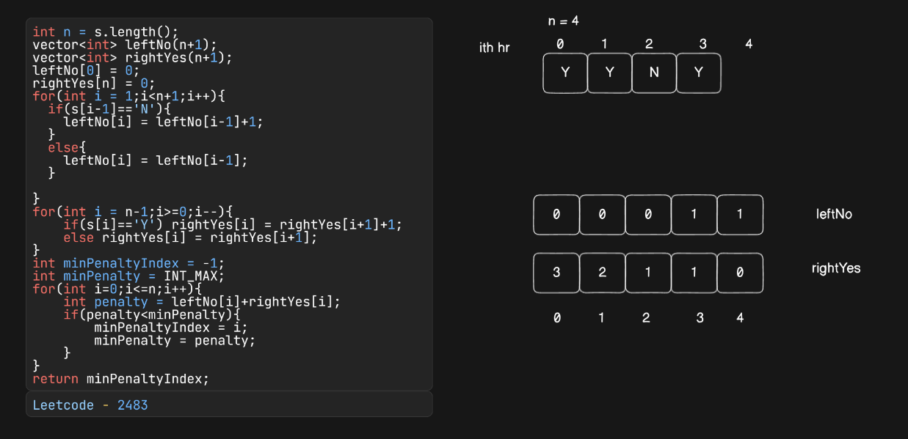

1. Min_Penalty_For_ShopFor every hour when the shop is open and no customers come, the penalty increases by 1.
2. For every hour when the shop is closed and customers come, the penalty increases by 1.
3. Return the earliest hour at which the shop must be closed to incur a minimum penalty.
4. brute force solution for this uses O(n^2) time complexity -
5. for(int i=0;i<N;i++)
       close the array at index i and calculate the penalty
       update the minimum penalty
  for the  shop closed at ith index  
6. Left me 

        Y - zero penalty
        N - one penalty
7. Closed at i

8. Right me

        Y -  penalty
        N -  no penalty

The solution this is using the prefix and suffix logic

9. Time complexity O(3n) and Space complexity is O(2n)

10. Mistake was in code - 

        leftNo[i] = leftNo[i-1]++;
        It doesn't do what we actually want because of the use of post increment operator rather we should just add 1. 