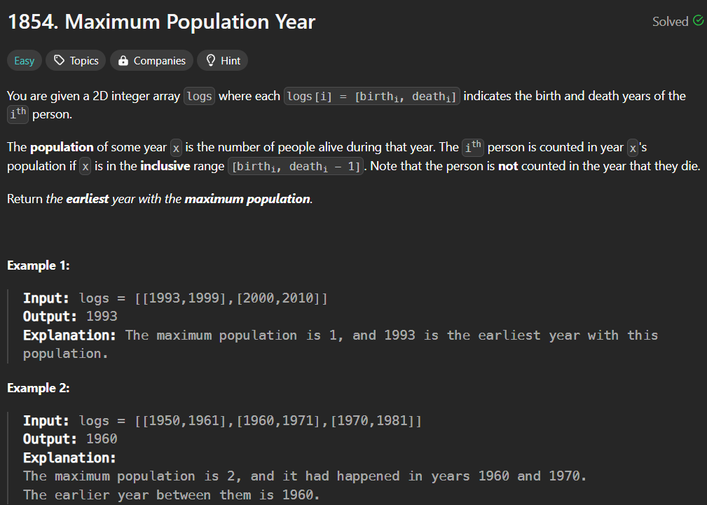
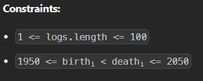

**Solution**
1. Janm liya toh population badhgayi ek se.
2. Khatam hue toh population kam hogyi ek se.

    for example for the input - {{1956,1980},{1960,1982}}
    

3. prefix sum find karlo.
4. Lowest index pe maximum population ko return kardo

### Note-1 : 

    Always look at the constraints it can give you the most important information for example here the birth and death year maximum goes from 1950 to 2050 so for prefix array we can get the size from here which will be 101

### Note-2 :

    New concept of sorting using comparator

    vector<vector<int>> ranges = {{1993, 1999}, {2000, 2010},{1500,3450}};

    void sortBasedOnFirst(vector<vector<int>> &ranges){
    sort(ranges.begin(),ranges.end(),{
        return a[0]<b[0];
    });
} 