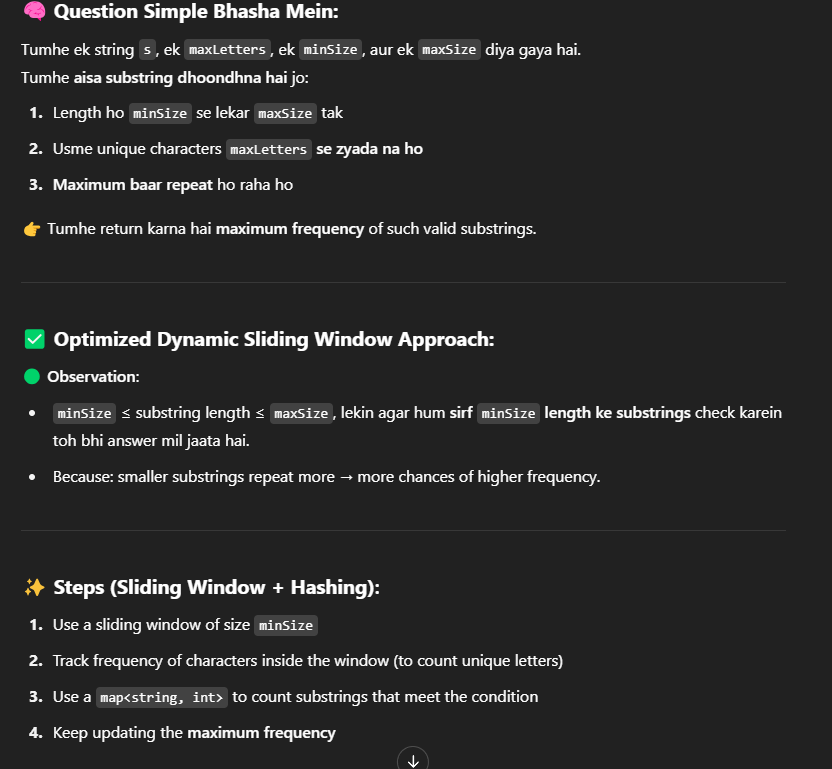

Note - 

    kya ye nahi hosaktaa ki minSIze se badaa koi valid substring zyaada baar aajaae

        Kya minSize se bada substring zyada baar aasakta hai?
        Technically haan, hosakta hai — lekin practically (aur is question ke constraints ke hisaab se), answer almost always minSize pe hi milta hai.

        Key Insight (From Problem Constraints):
        Substrings jitne bade honge, unke repeat hone ke chances kam ho jaate hain.

        minSize wale substrings ke paas zyada repeat hone ka scope hota hai, isiliye unka frequency zyada hota hai.

        Toh Kya maxSize ko ignore karna galat hai?
        Nahi — ye actually optimization hai.

        Brute-force way:

        Check every substring from minSize to maxSize → time complexity will be too high (O(n²))

        Optimized way:

        Sirf minSize length wale substrings pe focus karo — zyada repeat hone ke chances wahi pe hain

        Leetcode ke editorial ne bhi isi approach ko recommend kiya hai