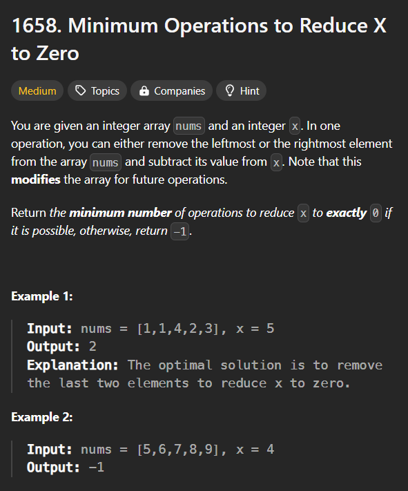
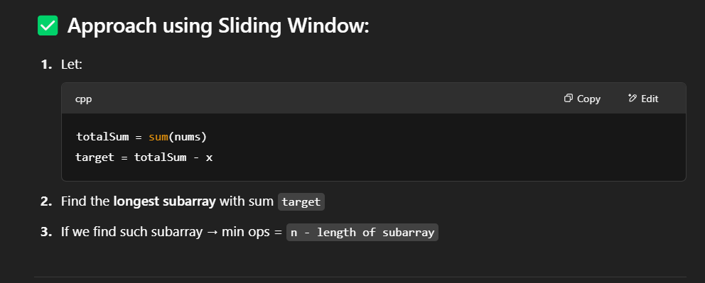
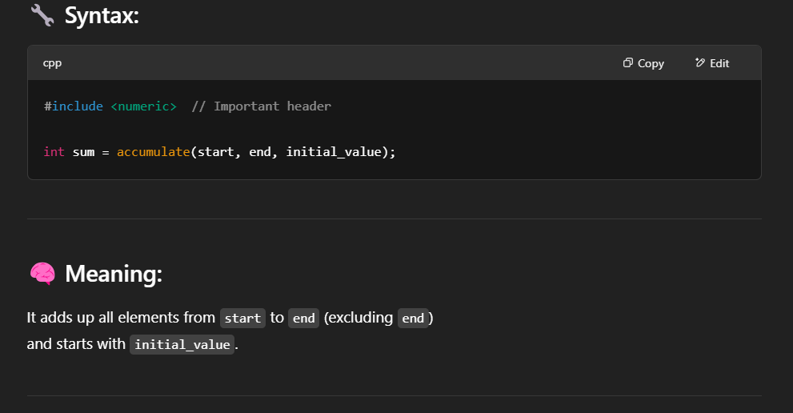
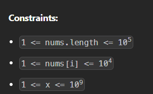
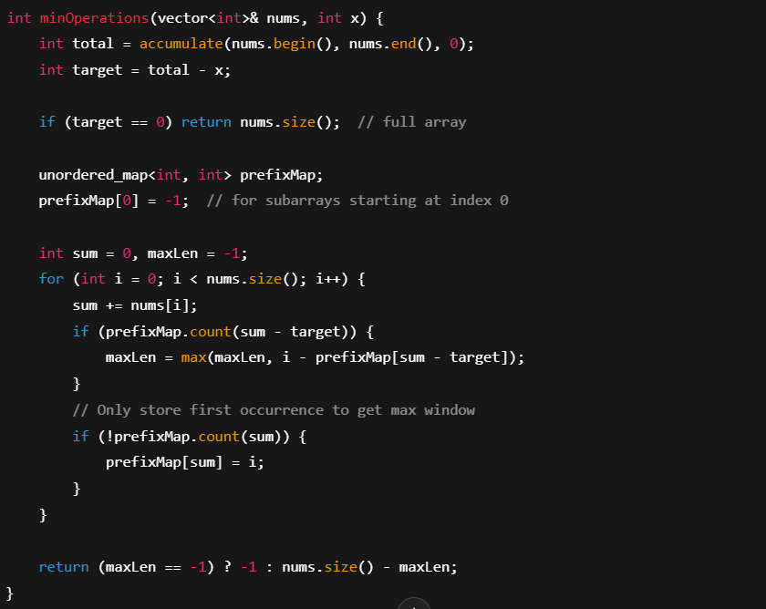

# V.impp Question with Many new Concepts

# Approach

##Note - 

1. The use of accumulate for calculating the tsum

2. 

    Here acc to constraint the value of the array is always positive therefore we can simply use sliding window and shrink the window from the left.However if constraints include negative values then we must use map for calculating the longest subarray with sum equals to tsum-x

    The Solution for negative constraint is given below - 

