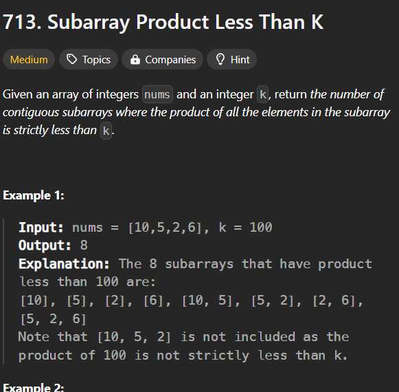
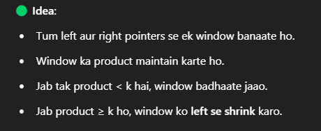

**Question**

## Approach

## NOTE

count += right - left + 1 har step pe kyun hota hai?

🎯 Mool Soch (Core Idea):
Jab tumhara window left se right tak valid hai (i.e., product < k),
toh is window ke andar jitne bhi subarrays end ho rahe hain at right,
wo sab valid hote hain.

🧠 Samjho with Example:
Maan lo:

cpp
Copy
Edit
nums = [1, 2, 3],  k = 10
Aur ab:

left = 0, right = 2

Tumhari window: [1, 2, 3]

Product: 6 → which is < 10 (valid window)

Ab is window mein kitne subarrays end ho rahe hain at right (index 2)?
👉 Ye subarrays hain:

[3]

[2, 3]

[1, 2, 3]

Yaani right se left tak ke sab subarrays ending at right

🟢 Total = right - left + 1