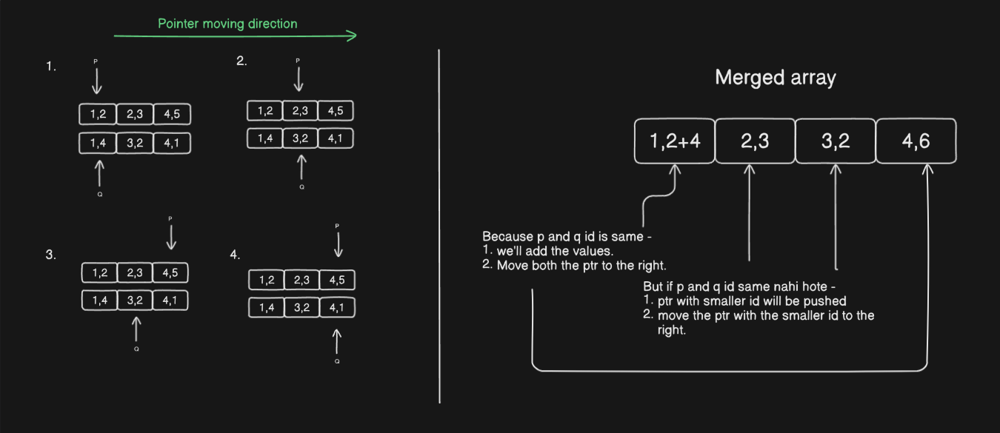

### Question
    You are given two 2D integer arrays nums1 and nums2.

    nums1[i] = [idi, vali] indicate that the number with the id idi has a value equal to vali.
    nums2[i] = [idi, vali] indicate that the number with the id idi has a value equal to vali.
    Each array contains unique ids and is sorted in ascending order by id.

    Merge the two arrays into one array that is sorted in ascending order by id, respecting the following conditions:

    Only ids that appear in at least one of the two arrays should be included in the resulting array.
    Each id should be included only once and its value should be the sum of the values of this id in the two arrays. If the id does not exist in one of the two arrays, then assume its value in that array to be 0.
    Return the resulting array. The returned array must be sorted in ascending order by id

    Merge with condition

        1. Sort by id
        2. union of both arrays
        3. if id exist in both ? value from num1+value from num2 : value from either

### Solution

#### Note - 

    while satisfying the conditions as shown in the figure you have to keep track of both the pointers because the size of the array may differ from each other 