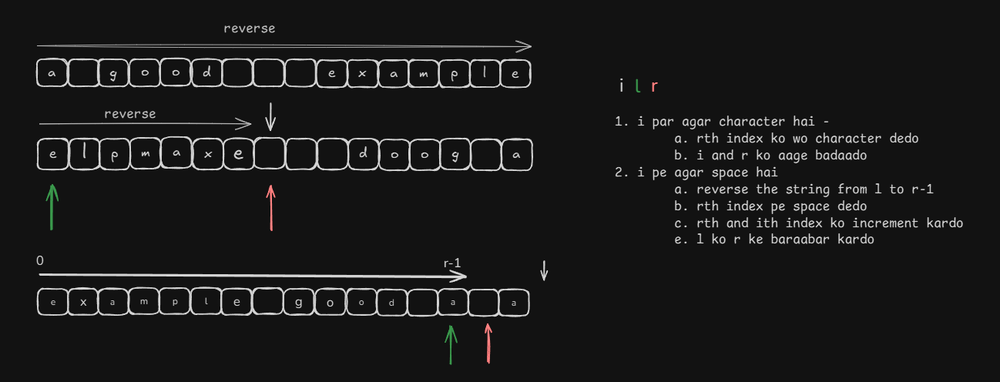

**Question**

Given an input string s, reverse the order of the words.

A word is defined as a sequence of non-space characters. The words in s will be separated by at least one space.

Return a string of the words in reverse order concatenated by a single space.

Note that s may contain leading or trailing spaces or multiple spaces between two words. The returned string should only have a single space separating the words. Do not include any extra spaces.

 **Solution**

Approach-1: Tokenizer

    Use stringstream to make the string clean and extract the words separated by one/more spaces

Approach-2:  Two Pointer approach

Simple - 

    1. Poore string ko reverse kardo
    2. Fir ek ek word ko reverse kardo 

Detail - 

    1. Jabtak ith index par agar character hai - 
        a. rth index ko wo character dedo
        b. i and r ko aage badaado
    2. i pe agar space hai
        a. reverse the string from l to r-1
        b. rth index pe space dedo
        c. rth index ko increment kardo
        e. l ko r ke baraabar kardo
    3. r-1 index tak ki string ko return kardenge

### Note - 

        while (i < n && s[i] != ' ') {
           s[r++] = s[i++];
        }

        In the above L(s)OC we have used i<n because if inside that iteration, the inner while loop may keep running and increment i until it hits n. then s[i] refers to memory past the end of the string as cpp doesn't perform bound checking on the operator autmatically.